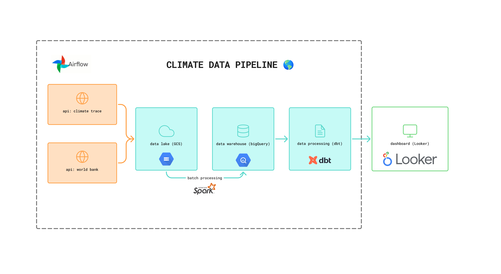
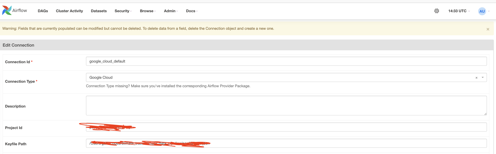
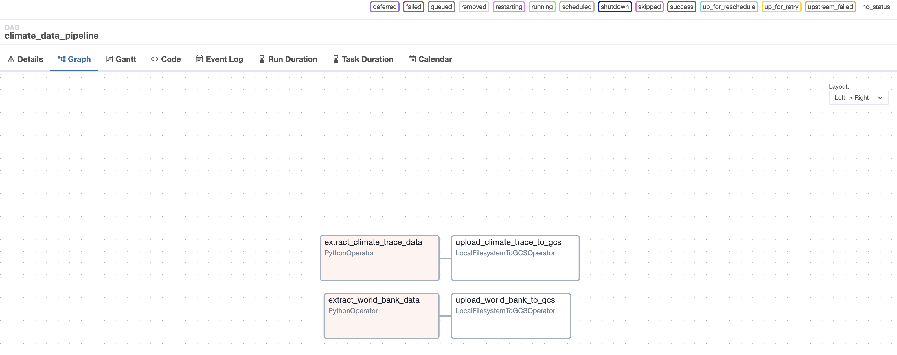
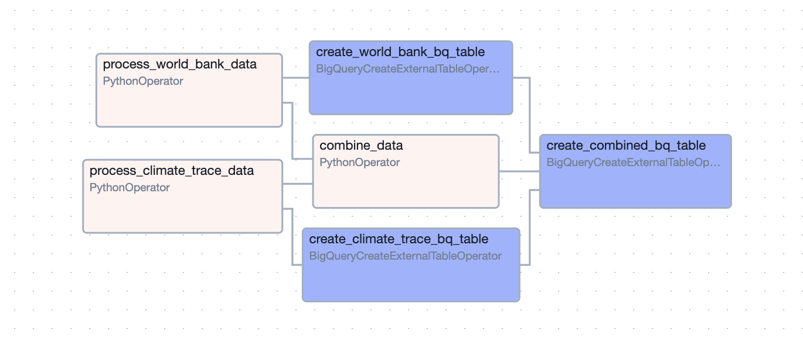
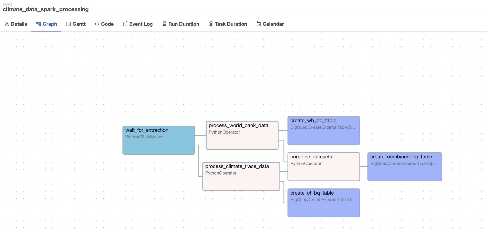

# Instructions

To replicate this project, make sure you have the following:

- A Google Cloud account with: a bucket, a service account (BigQuery and Storage Admin permissions), and two databases (one for datawarehouse, and another which will serve the dbt transformations to the dashboard).



You can replicate the project by following the instructions below.

## 1.0 Create a clean Anaconda Environment

- Create a new conda environment
`conda create -n airflow_env python=3.8`

- Activate the environment
`conda activate airflow_env`

## 2.0 Create the project structure

- Create a new project directory
`mkdir -p ~/climate_data_pipeline`
`cd ~/climate_data_pipeline`

- Create necessary subdirectories
`mkdir -p dags logs plugins config scripts data`
`mkdir -p data/world_bank data/climate_trace`

## 3.0 Install Airflow with constraints
- Install airflow
`pip install "apache-airflow==2.7.3" --constraint "https://raw.githubusercontent.com/apache/airflow/constraints-2.7.3/constraints-3.8.txt"`

- Install Google provider
`pip install apache-airflow-providers-google`
`pip install google-cloud-storage dlt`

## 4.0 Copy Python Scripts
- Copy your [extraction scripts](../extractors/) to the scripts folder
`cp /path/to/world_bank_extractor.py scripts/`

`cp /path/to/climate_trace_extractor.py scripts/`

## 5.0 Initialise Airflow Database
- Export Airflow home
`export AIRFLOW_HOME=~/climate_data_project`

- Initialize the database
`airflow db init`

- Create an admin user
```bash
airflow users create \
    --username admin \
    --firstname Admin \
    --lastname User \
    --role Admin \
    --email admin@example.com \
    --password admin
```

## 6.0 Create your DAG file

Create a [dag file](./../climate_data_pipeline/dags/climate-data-dag.py)


## 7.0 Start Aiflow Services

Run the commands below in two different terminals:

```bash
cd ~/climate_data_pipeline
conda activate airflow_env
export AIRFLOW_HOME=/Users/gabi/codes/climate_trace/climate_data_pipeline
airflow webserver --port 8080
```

Terminal 02:

```bash
cd ~/climate_data_project
conda activate airflow_env
export AIRFLOW_HOME=/Users/gabi/codes/climate_trace/climate_data_pipeline
airflow scheduler
```

## 8.0 Access the Airflow UI

Once both services are running, access the Airflow UI at:
http://localhost:8080

Login with:

Username: admin
Password: admin

In admin, add the connection to GSC.



## 9.0 Create the DAG and data_extractor
Create a [data_extractor](./../climate_data_pipeline/scripts/data_extractor.py), which combines the climate and word bank extractors.

With this, you can create dag [climate-data-dag](../climate_data_pipeline/dags/climate-data-dag.py).




## 10.0 Run the DAG

In the DAG above, you will need to specify the year to collect the data.
This can be done in different ways.

**Option 01: Via the Airflow UI**
- Go to Admin >> Variables
- Set Key as "extraction_year" and Value as your desired year (e.g., "2016")

**Option 02: triggering the DAG via API**
````bash
curl -X POST \
  http://localhost:8080/api/v1/dags/climate_data_pipeline/dagRuns \
  -H 'Content-Type: application/json' \
  --user "username:password" \
  -d '{"conf": {"extraction_year": 2016}}'
````

**⚠️ You will need to run the dag for 2015 to 2024 as a backfill.**


## 11.0 Batch processing

We have two options for batch processing.

### 11.1 Batch processing with Python script

In this option, we will use [this Python script](../climate_data_pipeline/scripts/python_processor.py) in this [dag](../climate_data_pipeline/dags/historical-python-processing-dag.py). This script is intended for historical processing. 

The workflow is as structured:

- You process the World Bank data and Climate Trace data separately
- You combine these datasets into a single dataset
- You create three BigQuery tables: one for each original dataset and one for the combined data (append the data to the table, if it already exists)



- Process Tasks (in pink):
    - process_world_bank_data (PythonOperator)
    - process_climate_trace_data (PythonOperator)

- Combine Task (in pink):
    - combine_data (PythonOperator) - This is your single data combination task


- BigQuery Table Creation Tasks (in blue):
    - create_world_bank_bq_table (BigQueryCreateExternalTableOperator)
    - create_climate_trace_bq_table (BigQueryCreateExternalTableOperator)
    - create_combined_bq_table (BigQueryCreateExternalTableOperator)

### 11.2 Batch processing with PySpark
You can also use PySpark to process the data from the data lake (Google buckets) to a data warehouse (BigQuery).

With the virtual environment active, download Pyspark:

`pip install pyspark`

- Create a new file in the scripts directory: [spark_processor.py](../climate_data_pipeline/scripts/spark_processor.py)
- Create a new dag [spark-processing-dag.py](../climate_data_pipeline/dags/spark-processing-dag.py)



The structure above will wait for the extraction dag to complete, proceding to process the data.

Additionally, by creating [another DAG for historical processing](../climate_data_pipeline/dags/historical-spark-processing-dag.py), we implement a modular approach which gives us flexibility to run either DAG independently if needed.

This approach will let you process any historical data that's already in your bucket without having to re-download it through your extraction pipeline. It's perfect for:

- Reprocessing data with an updated Spark transformation
- Processing multiple years of historical data in sequence
- Testing your Spark transformations on existing data

**Additional considerations for production deployment**
For a production environment, you may want to consider:

- Using a dedicated Spark cluster instead of running Spark within Airflow
- Configuring Spark memory and executor settings based on your data volume
- Adding error handling and retries for the Spark jobs
- Setting up monitoring for the Spark jobs


## 12.0 Data transformation with dbt

### Step 01: Install dbt in your virtual environment

```bash
# Activate your virtual environment
source venv/bin/activate  # or conda activate your_env

# Install dbt Core with BigQuery adapter
pip install dbt-bigquery

# Verify installation
dbt --version
```

### Step 02:  Initialise a dbt project

```bash
# Navigate to your climate_data_pipeline directory
cd climate_data_pipeline

# Create a dbt project folder
mkdir dbt_climate_data

# Navigate to the dbt project folder
cd dbt_climate_data

# Initialize a new dbt project
dbt init climate_transforms
```

### Step 03: Check your bigQuery connection:

```bash
mkdir -p ~/.dbt
nano ~/.dbt/profiles.yml
```

If you followed the instructions during the dbt initialisation, your file should be fine. But just in case, check if it follows the format:

```yaml
climate_transforms:
  target: dev
  outputs:
    dev:
      type: bigquery
      method: service-account
      project: your-gcp-project-id  # Update with your GCP project ID
      dataset: zoomcamp_climate_transformed  # This will be your destination dataset
      location: US  # Update if your data is in a different region
      threads: 4
      keyfile: /path/to/your/service-account-key.json  # Update with your keyfile path
      timeout_seconds: 300
```


### Step 04: Create dbt Models Based on Your Combined Table

All the models can be found [here](../climate_data_pipeline/dbt_climate_data/climate_transforms/models/)

### Step 05: Create a `sources` configuration file

The file can be found [here](../climate_data_pipeline/dbt_climate_data/climate_transforms/models/staging/sources.yml).

### Step 06: Update the dbt project configuration

The file can be found [here](../climate_data_pipeline/dbt_climate_data/climate_transforms/dbt_project.yml)

### Step 07: Add documentation and tests

- Create a [schema for your models](../climate_data_pipeline/dbt_climate_data/climate_transforms/models/schema.yml)

- Create an [Airflow DAG to orchestrate dbt](../climate_data_pipeline/dags/dbt-transform-dag.py)

- Test the configurations and run your models.

```bash
# Navigate to your dbt project
cd climate_transforms

# Test the connection
dbt debug

# Run the models
dbt run

# Test data quality
dbt test

# Generate documentation
dbt docs generate
dbt docs serve
```

### Step 08: Create views for dashboard
The views created for the dashboard can be found [here](../climate_data_pipeline/dbt_climate_data/climate_transforms/models/dashboard/)

